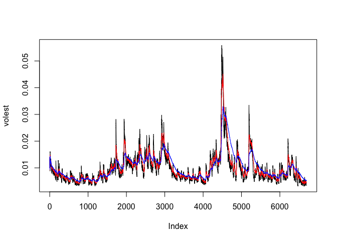

MSDS 6306 - Live Session 11 Assignment
================

Retrieve Data
-------------

``` r
SNPdata <- get.hist.quote('^gspc',quote="Close")
```

    ## 'getSymbols' currently uses auto.assign=TRUE by default, but will
    ## use auto.assign=FALSE in 0.5-0. You will still be able to use
    ## 'loadSymbols' to automatically load data. getOption("getSymbols.env")
    ## and getOption("getSymbols.auto.assign") will still be checked for
    ## alternate defaults.
    ## 
    ## This message is shown once per session and may be disabled by setting 
    ## options("getSymbols.warning4.0"=FALSE). See ?getSymbols for details.

    ## 
    ## WARNING: There have been significant changes to Yahoo Finance data.
    ## Please see the Warning section of '?getSymbols.yahoo' for details.
    ## 
    ## This message is shown once per session and may be disabled by setting
    ## options("getSymbols.yahoo.warning"=FALSE).

    ## time series ends   2017-07-28

Analyze Data
------------

``` r
SNPret <- log(lag(SNPdata)) - log(SNPdata)

SNPvol <- sd(SNPret) * sqrt(250) * 100

get 
```

    ## function (x, pos = -1L, envir = as.environment(pos), mode = "any", 
    ##     inherits = TRUE) 
    ## .Internal(get(x, envir, mode, inherits))
    ## <bytecode: 0x7ff209a6a110>
    ## <environment: namespace:base>

``` r
Vol <- function(d, logrets)
{

    var = 0

    lam = 0

    varlist <- c()

    for (r in logrets) {

        lam = lam*(1 - 1/d) + 1
    
    var = (1 - 1/lam)*var + (1/lam)*r^2

        varlist <- c(varlist, var)

    }

    sqrt(varlist)
}
```

Plot Data
---------

``` r
volest <- Vol(10,SNPret)

volest2 <- Vol(30,SNPret)

volest3 <- Vol(100,SNPret)

plot(volest,type="l")

lines(volest2,type="l",col="red")

lines(volest3, type = "l", col="blue")
```


